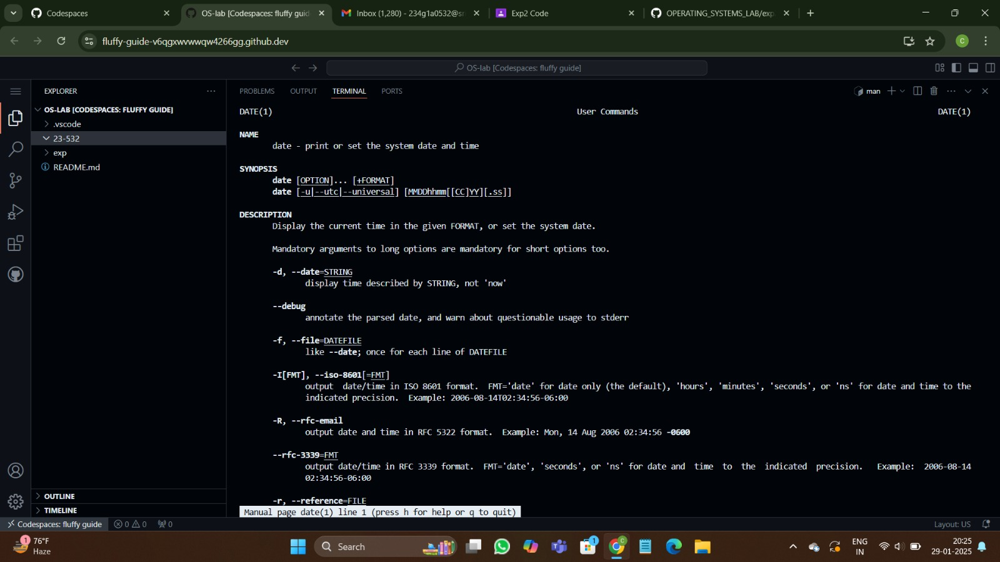
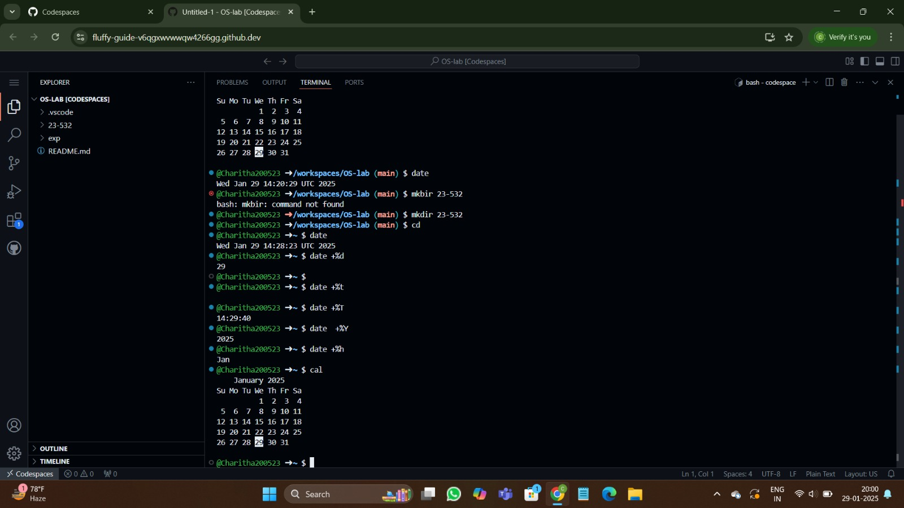
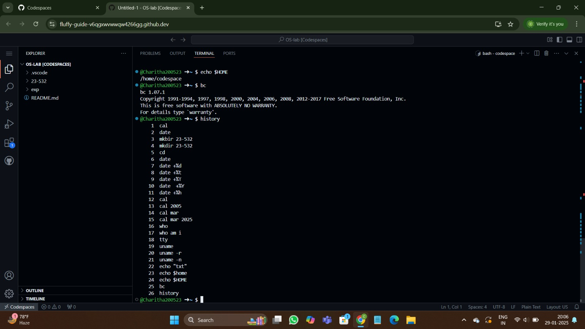
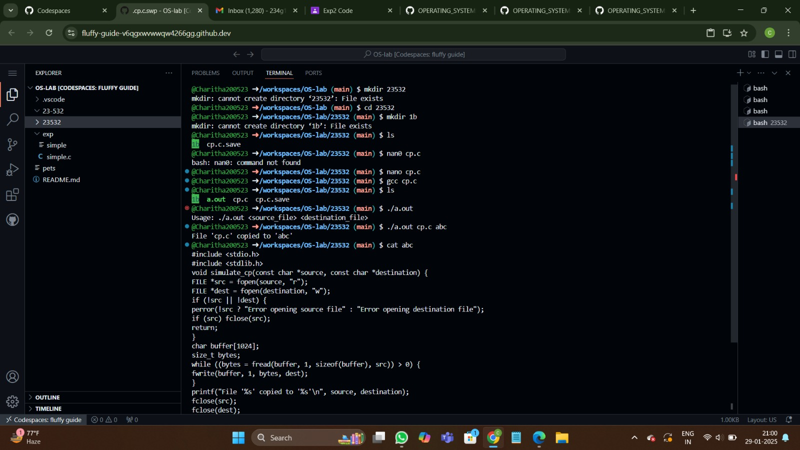
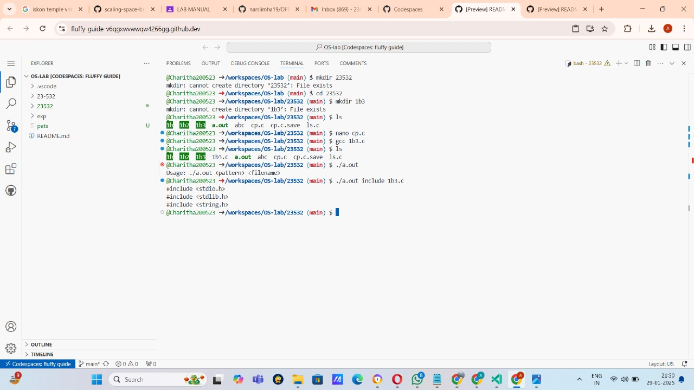

# os-lab
> ## Exp1: basics of unix commands

>PROCEDURE: Login into the ubuntu terminal use Ctrl + Alt + t windows shortcut key or go to activity bar search for terminal and mouse click the terminal open.

> ## Commands with Descriptions

> ## GENERAL COMMANDS

c
  date
  Used to display the current system date and time.
  date +%D
  Displays date only
  date +%T
  Displays time only
  date +% Y
  Displays the year part of date
  date +% H
  Displays the hour part of time
  cal
  Calendar of the current month
  cal year
  Displays calendar for all months of the specified year
  cal month year
  Displays calendar for the specified month of the year
  who
  Login details of all users such as their IP, Terminal No, User name,
  who am i
  Used to display the login details of the user
  tty
  Used to display the terminal name
  uname
  Displays the Operating System
  unameOperating System Lab Manual Department of CSE, SRIT, ATP
  Prepared by Mr. M. Narasimhulu, 4
  Shows version number of the OS (kernel).
  uname –n
  Displays domain name of the server
  echo "txt"
  Displays the given text on the screen
  echo $HOME
  Displays the user's home directory
  bc
  Basic calculator. Press Ctrl+d to quit
  lpfile
  Allows the user to spool a job along with others in a print queue.
  man cmdname
  Manual for the given command. Press q to exit
  history
  To display the commands used by the user since log on.
  exit
  Exit from a process. If shell is the only process then logs out

> ## DIRECTORY COMMANDS

c
pwd
Path of the present working directory
mkdir dir
A directory is created in the given name under the current directory
mkdir dir1 dir2
A number of sub-directories can be created under one stroke
cd subdir
Change Directory. If the subdir starts with / then path starts from root (absolute)
otherwise from current working directory.
Cd
To switch to the home directory.
cd /
To switch to the root directory.
cd ..
To move back to the parent directory
rmdir subdir
Removes an empty sub-directory.
c

> ## FILE COMMANDS

c
cat >filename
To create a file with some contents.
To end typing press
Ctrl+d.
The >symbol means redirecting output to a file. (<for input)
cat filename
Displays the file contents.
cat >>filename
Used to append contents to a file
cp src des
Copy files to given location. If already exists, it will be overwritten
cp –i src des
Warns the user prior to overwriting the destination file
cp –r src des
Copies the entire directory, all its sub-directories and files.
mv old new
To rename an existing file or directory. –i option can also be used
mv f1 f2 f3 dir
To move a group of files to a directory.
mv –v old new Di
Display name of each file as it is moved.
rm file
Used to delete a file or group of files. –i option can also be used
rm *
To delete all the files in the directory.
rm –r *
Deletes all files and sub-directories
rm –f *
To forcibly remove even write-protected files
ls
Lists all files and subdirectories (blue colored) in sorted Order
ls name
To check whether a file or directory exists.
ls name *
Short-hand notation to list out filenames of a specific pattern.
ls –a
Lists all files including hidden files (files beginning with .)
ls –x dirname
To have specific listing of a directory.
ls –R
Recursive listing of all files in the subdirectories
ls –l
Long listing showing file access rights (read/write/execute-rwx for user/group/others-
ugo).
cmp file1 file2
Used to compare two files. Displays nothing if files are identical.
Wc file It produces a statistics of lines (l), words(w), and characters(c).
chmod perm file
Changes permission for the specified file. (r=4, w=2, x=1)
chmod 740 file
sets all rights for user, read only for groups and no rights for others

> ## RESULT
Thus the study and execution of Unix commands has been completed successfully.

> ## Simulate UNIX commands like cp, ls, grep, etc

> ## Cp simulate command Source code

c
#include <stdio.h>
#include <stdlib.h>
void simulate_cp(const char *source, const char *destination) {
FILE *src = fopen(source, "r");
FILE *dest = fopen(destination, "w");
if (!src || !dest) {
perror(!src ? "Error opening source file" : "Error opening destination file");
if (src) fclose(src);
return;
}
char buffer[1024];
size_t bytes;
while ((bytes = fread(buffer, 1, sizeof(buffer), src)) > 0) {
fwrite(buffer, 1, bytes, dest);
}
printf("File '%s' copied to '%s'\n", source, destination);
fclose(src);
fclose(dest);
}
int main(int argc, char *argv[]) {
if (argc != 3) {
fprintf(stderr, "Usage: %s <source_file> <destination_file>\n", argv[0]);
return EXIT_FAILURE;
}
simulate_cp(argv[1], argv[2]);
return EXIT_SUCCESS;
}

> ## Simulation code for ls command

c
#include <stdio.h>
#include <stdlib.h>
#include <dirent.h>
void simulate_ls(const char *path) {
struct dirent *entry;
DIR *dir = opendir(path);
if (!dir) {
perror("Error opening directory");
return;
}
while ((entry = readdir(dir)) != NULL) {
if (entry->d_name[0] != '.') {
printf("%s ", entry->d_name);
}
}
printf("\n");
closedir(dir);
}int main(int argc, char *argv[]) {
const char *path = argc > 1 ? argv[1] : ".";
simulate_ls(path);
return 0;
}

> ## Simulate Grep command

c
#include <stdio.h>
#include <stdlib.h>
#include <string.h>
void simulate_grep(const char *pattern, const char *filename) {
FILE *file = fopen(filename, "r");
if (!file) {
perror("Error opening file");
return;
}
char line[1024];
while (fgets(line, sizeof(line), file)) {
if (strstr(line, pattern)) { // Check if pattern exists in the line
printf("%s", line);
}
}
fclose(file);
}int main(int argc, char *argv[]) {
if (argc != 3) {
fprintf(stderr, "Usage: %s <pattern> <filename>\n", argv[0]);
return EXIT_FAILURE;
}
simulate_grep(argv[1], argv[2]);
return EXIT_SUCCESS;
}

